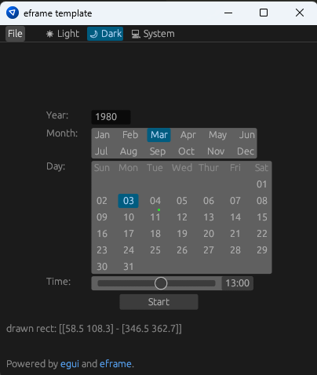

# date_selector_demo

+ This is a simple date picker widget.
+ The code is built on **Rust** for **[egui/eframe](https://github.com/emilk/eframe_template)** framework.
+ Since it uses eframe, it compiles to windows/linux/mac/wasm.
+ The date picker is still a big wip, imho.
+ Refer to `lib.rs` to see the modules.
+ `cargo run` in the project directory to run the demo.

